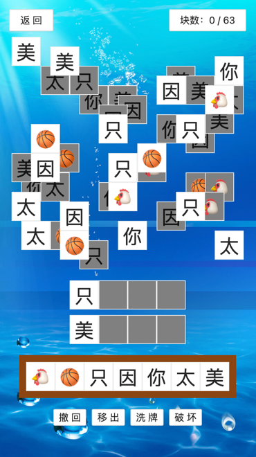

# 鱼了个鱼

> 被羊了个羊虐了百遍后，我自己做了一个！

在线体验：https://yulegeyu.cn

游戏视频：https://www.bilibili.com/video/BV1Pe411M7wh

相关文章：https://mp.weixin.qq.com/s/D_I1Tq-ofhKhlp0rkOpaLA

游戏截图（自定义了图案）：

游戏特色：

1. 支持选择难度（4 种）
2. 支持自定义难度
3. 支持自定义动物图案（比如 🐔🏀）
4. 可以无限使用技能（道具）
5. 不需要看广告
6. 能通关

> 补一句：就出于兴趣做了几个小时，有 bug 正常哈哈，欢迎 PR~

简单说下实现原理，主要有 4 个点：

1. 游戏全局参数：做游戏的同学都知道，游戏中会涉及很多参数，比如槽位数量、层数等等。我们要将这些参数抽取成统一的全局变量，供其他变量使用。从而做到修改一处，游戏自动适配。还可以提供页面来让用户自定义这些参数，提高游戏的可玩性。
2. 网格：为了让块的分布相对规整、并且为计算坐标提供方便，我将整个游戏画布分为 24 x 24 的虚拟网格，类似一个棋盘。一个块占用 3 x 3 的格子。
3. 随机生成块：包括随机生成方块的图案和坐标。首先我根据全局参数计算出了总块数，然后用 shuffle 函数打乱存储所有动物图案的数组，再依次将数组中的图案填充到方块中。生成坐标的原理是随机选取坐标范围内的点，坐标范围可以随着层级的增加而递减，即生成的图案越来越挤，达到难度逐层加大的效果。
4. 块的覆盖关系：怎么做到点击上层的块后，才能点下层的块呢？首先要给每个块指定一个层级属性。然后有两种思路，第 1 种是先逐层生成，然后每个格子里层级最高的块依次判断其周围格子有没有块层级大于它；第 2 种是在随机生成块的时候就给相互重叠的块绑定层级关系（即谁覆盖了我？我覆盖了谁？）。这里我选择了第 2 种方法，感觉效率会高一些。

